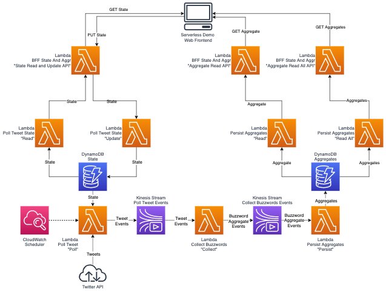

# Serverless Demo

This is a demo for serverless computing. The demo implements an event streaming / sourcing
pattern using serverless components from AWS. The lock-in to AWS is controlled by the
[Serverless.com](https://serverless.com) framework.

## Solution Overview



The provided solution queries over Twitter API tweets based on certain buzzwords (hashtags). 
This query inside a lambda is run every minute by a scheduler. Received tweets are packaged as events an put into a Kinesis stream.
See [./poll-tweet/README.md](./poll-tweet/README.md) for more.

These events are collected and aggregated by another lambda. An aggregate consist of the core buzzword and sum of occurrences of other buzzwords in the relevant tweets.
The aggregates are again package as events an put into a second Kinesis stream.
See [./collect-buzzwords/README.md](./collect-buzzwords/README.md) for more.

The events with the aggregated values for latest batch are collected by a next lambda which makes 
final aggregation with the already persisted data for each buzzword in DynamoDB.
See [./persist-aggregates/README.md](./persist-aggregates/README.md) for more. 

The definition of the buzzwords for queries are stored as state in DynamoDB.
See [./poll-tweet-state/README.md](./poll-tweet-state/README.md) for more.

A specialized set of BFF (backend for frontend) lambdas allows an UI client to present data and update state if necessary.
See [./bff-state-and-aggregate/README.md](./bff-state-and-aggregate/README.md)

The solution follows one of the core principles when building serverless applications named SoC (separation of concerns).
Each lambda functions realize only one tasks. These tasks are grouped in modules described shortly below.

The Twitter API keys are managed as secrets by SecretManager and diagnostic information is made available using CloudWatch.

## Appendix A: Cheat Sheets

### Upgrade AWS CLI on MacOS

```(sh)
sudo -H pip install --upgrade awscli --ignore-installed six
```

### Read Kinesis via CLI

```(sh)
aws kinesis create-stream --stream-name $AWS_EVENT_STREAM_NAME --shard-count 1

aws kinesis put-record --stream-name $AWS_EVENT_STREAM_NAME --partition-key 123 --data testdata

aws kinesis describe-stream --stream-name $AWS_EVENT_STREAM_NAME --region $AWS_REGION

SHARD_ITERATOR=$(aws kinesis get-shard-iterator --shard-id shardId-000000000000 --shard-iterator-type TRIM_HORIZON --stream-name $AWS_EVENT_STREAM_NAME --query 'ShardIterator')
aws kinesis get-records --shard-iterator $SHARD_ITERATOR
aws kinesis delete-stream --stream-name $AWS_EVENT_STREAM_NAME
```

## Appendix B: References

The following resources proved to be useful during the creation of this demo

### Serverless

* [Serverless AWS Documentation](https://serverless.com/framework/docs/providers/aws/)
* [Serverless Lambda Go Events](https://serverless.com/blog/framework-example-golang-lambda-support/)
* [Serverless Examples](https://github.com/serverless/examples)
* [Serverless IAM Configuration](https://gist.github.com/ServerlessBot/7618156b8671840a539f405dea2704c8)
* [Serverless Localstack](https://github.com/localstack/serverless-localstack)

### AWS

* [AWS SDK for Go](https://docs.aws.amazon.com/sdk-for-go/v1/developer-guide/welcome.html)
* [AWS Lambda Go Events](https://github.com/aws/aws-lambda-go/tree/master/events)
* [AWS Kinesis Introduction](https://docs.aws.amazon.com/streams/latest/dev/key-concepts.html)
* [AWS Kinesis CLI](https://docs.aws.amazon.com/streams/latest/dev/fundamental-stream.html)
* [AWS S3 CLI](...)

### Other

* [Twitter Event Source](https://github.com/awslabs/aws-serverless-twitter-event-source)
* [Language Analysis](https://github.com/chrisport/go-lang-detector)
* [Sentiment Analysis](https://github.com/cdipaolo/sentiment)
